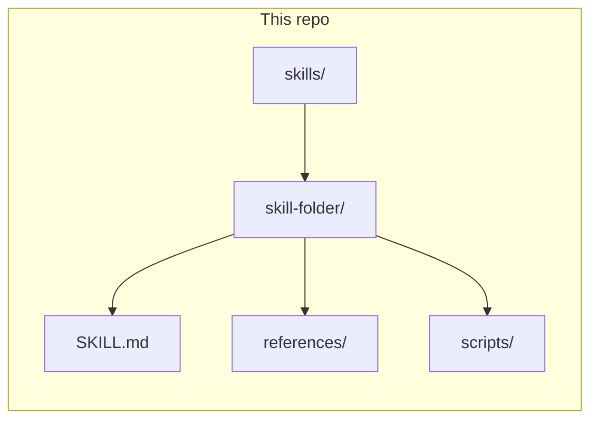

# Personal agent skills

This repository is a personal, version-controlled collection of [Agent Skills](https://agentspec.dev/)-style packages: each skill is a self-contained directory with a primary `SKILL.md` that routes to optional references and scripts. Skills are meant to be copied or symlinked into whatever host you use (Cursor, Claude Code, or similar) so agents load them as tool-augmented instructions.

## Repository layout

- **`skills/`** — one subdirectory per skill. The entry point is always `SKILL.md` with YAML frontmatter (`name`, `description`, and sometimes other fields). The `description` is what discovery systems use to decide when to load the skill.
- **`references/`** — optional; used for progressive disclosure when the main body would be too large. The [skill-writer](skills/wkill-writer/) skill bundles many reference files here.
- **`scripts/`** — optional automation; [quick_validate.py](skills/wkill-writer/scripts/quick_validate.py) checks structure and frontmatter for a skill directory.



## Skills index

| Folder | `name` (frontmatter) | Purpose |
|--------|----------------------|---------|
| [wkill-writer](skills/wkill-writer/) | `skill-writer` | Create, synthesize, and iterate skills against the Agent Skills specification. |
| [setup-skills](skills/setup-skills/) | `setup-skills` | Scaffold `AGENTS.md` / `CLAUDE.md` and `docs/agents/` so other skills know your issue tracker, triage labels, and domain docs layout. |
| [tdd](skills/tdd/) | `tdd` | Test-driven development (red–green–refactor), integration tests, test-first workflows. |
| [improve-codebase-architecture](skills/improve-codebase-architecture/) | `improve-codebase-architecture` | Find deepening and refactoring opportunities using `CONTEXT.md` and ADRs. |
| [grill](skills/grill/) | `grill` | Stress-test a plan against the domain model; update `CONTEXT.md` and ADRs as decisions land. |
| [ticket-researcher](skills/ticket-researcher/) | `ticket-researcher` | Expand thin tickets with research (e.g. web + library docs). |
| [to-prd](skills/to-prd/) | `to-prd` | Production-grade PRDs from conversation or greenfield ideas (including AI features); publish to the issue tracker. |
| [to-features](skills/to-features/) | `to-features` | Break a to-prd-shaped PRD into vertical slices (Slice 0…n) in TDD-friendly order. |
| [to-feature-prd](skills/to-feature-prd/) | `to-feature-prd` | One slice → short sanity pass → `docs/{feature-slug}/PRD.md`. |
| [finish-feature](skills/finish-feature/) | `finish-feature` | After slice tickets ship: verify against the repo; write **`docs/{feature-slug}/IMPLEMENTED.md`**. |
| [to-issues](skills/to-issues/) | `to-issues` | Break a plan or PRD into independently grabbable tracker issues. |
| [caveman](skills/caveman/) | `caveman` | Ultra-compressed replies to save tokens while keeping technical accuracy. |

The directory name and frontmatter `name` usually match; today **wkill-writer** is the exception (`name: skill-writer` in [skills/wkill-writer/SKILL.md](skills/wkill-writer/SKILL.md)).

## How to use these skills

**Install per your host’s documentation.** For Cursor, copy or symlink individual skill folders into a skills location your workspace or user config uses (often under `.cursor/skills/` for a project or your user Cursor config). See [Cursor Agent Skills](https://cursor.com/docs/context/skills) for current install paths and behavior.

Many engineering-oriented skills assume repository context configured by [setup-skills](skills/setup-skills/SKILL.md) (issue tracker, triage label strings, where domain docs live). Run or adapt that flow once per target repo when those skills need that wiring.

**Validate after edits.** From the repo root, structural checks (frontmatter, `SKILL.md` presence, referenced paths) can be run with:

```bash
uv run skills/wkill-writer/scripts/quick_validate.py skills/<skill-folder>
```

Replace `<skill-folder>` with the directory name (e.g. `tdd`).

## Scope

This is a personal collection, not a supported product. Individual skills may assume external tools or services (for example `gh`, `glab`, web search, or documentation MCPs) when their bodies instruct you to use them.
