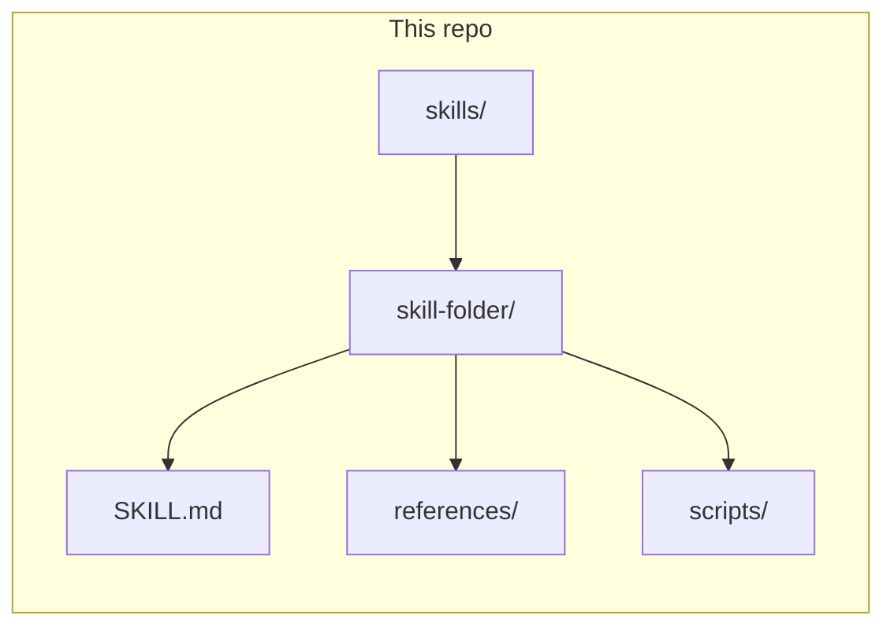
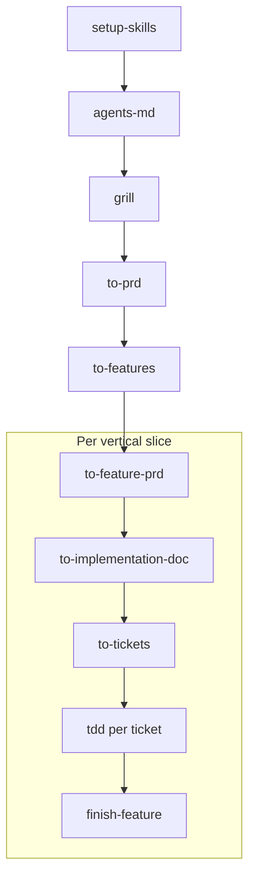

# Personal agent skills

This repository is a personal, version-controlled collection of Agent Skills each skill is a self-contained directory with a primary `SKILL.md` that routes to optional references and scripts. Skills are meant to be copied or symlinked into whatever host you use (Cursor, Claude Code, or similar) so agents load them as tool-augmented instructions.

## Repository layout

- **`skills/`** — one subdirectory per skill. The entry point is always `SKILL.md` with YAML frontmatter (`name`, `description`, and sometimes other fields). The `description` is what discovery systems use to decide when to load the skill.
- **`references/`** — optional; used for progressive disclosure when the main body would be too large. The [skill-writer](skills/skill-writer/) skill bundles many reference files here.
- **`scripts/`** — optional automation; [quick_validate.py](skills/skill-writer/scripts/quick_validate.py) checks structure and frontmatter for a skill directory.



## Skills index

| Folder | `name` (frontmatter) | Purpose |
|--------|----------------------|---------|
| [skill-writer](skills/skill-writer/) | `skill-writer` | Create, synthesize, and iterate skills against the Agent Skills specification. |
| [setup-skills](skills/setup-skills/) | `setup-skills` | Scaffold `AGENTS.md` / `CLAUDE.md` and `docs/agents/` so other skills know your issue tracker, triage labels, and domain docs layout. |
| [agents-md](skills/agents-md/) | `agents-md` | Concise root `AGENTS.md` / `CLAUDE.md` from repo signals and user or project requirements. |
| [tdd](skills/tdd/) | `tdd` | Test-driven development (red–green–refactor), integration tests, test-first workflows. |
| [improve-codebase-architecture](skills/improve-codebase-architecture/) | `improve-codebase-architecture` | Find deepening and refactoring opportunities using `CONTEXT.md` and ADRs. |
| [grill](skills/grill/) | `grill` | Stress-test a plan against the domain model; update `CONTEXT.md` and ADRs as decisions land. |
| [ticket-researcher](skills/ticket-researcher/) | `ticket-researcher` | Expand thin tickets with research (e.g. web + library docs). |
| [to-prd](skills/to-prd/) | `to-prd` | Production-grade parent PRDs from conversation or greenfield ideas at `docs/{initiative-slug}/PRD.md`; issue-tracker publication is optional. |
| [to-features](skills/to-features/) | `to-features` | Break a to-prd-shaped PRD into vertical slices (Slice 0…n) in TDD-friendly order. |
| [to-feature-prd](skills/to-feature-prd/) | `to-feature-prd` | One slice → short sanity pass → `docs/{feature-slug}/PRD.md`. |
| [to-implementation-doc](skills/to-implementation-doc/) | `to-implementation-doc` | Bridge `docs/{feature-slug}/PRD.md` → `IMPLEMENTATION.md` for ticket breakdown. |
| [to-tickets](skills/to-tickets/) | `to-tickets` | Slice PRD + implementation outline → numbered markdown tickets under `docs/{feature-slug}/tickets/`. |
| [finish-feature](skills/finish-feature/) | `finish-feature` | After slice tickets ship: verify against the repo; write **`docs/{feature-slug}/IMPLEMENTED.md`**. |
| [caveman](skills/caveman/) | `caveman` | Ultra-compressed replies to save tokens while keeping technical accuracy. |

The directory name and frontmatter `name` match for the skills in this repo.

## How to use these skills

**Install per your host’s documentation.** For Cursor, copy or symlink individual skill folders into a skills location your workspace or user config uses (often under `.cursor/skills/` for a project or your user Cursor config). See [Cursor Agent Skills](https://cursor.com/docs/context/skills) for current install paths and behavior.

Many engineering-oriented skills assume repository context configured by [setup-skills](skills/setup-skills/SKILL.md) (issue tracker, triage label strings, where domain docs live). Run or adapt that flow once per target repo when those skills need that wiring.

**Validate after edits.** From the repo root, structural checks (frontmatter, `SKILL.md` presence, referenced paths) can be run with:

```bash
uv run skills/skill-writer/scripts/quick_validate.py skills/<skill-folder>
```

Replace `<skill-folder>` with the directory name (e.g. `tdd`).

## Recommended execution order (greenfield pipeline)

Use this sequence when turning an idea into scoped docs, tickets, and shipped slices. Skill names match YAML `name` in each folder’s `SKILL.md`.

**Context:** Run **grill** and **to-prd** in the **same chat** so the PRD inherits the grilling session. Open a **fresh context** for **to-features** and point the agent at the **project-level** PRD (file path is easiest). Repeat the per-slice steps (6–10) for each vertical slice from **to-features**.

**Parent PRD file:** In the target repo, treat **`docs/{initiative-slug}/PRD.md`** as the canonical markdown handoff for later steps. When you run **to-prd**, have the agent write the approved PRD to that path. Issue-tracker publication is optional per [setup-skills](skills/setup-skills/SKILL.md); if a tracker copy is primary, pass that issue URL or paste the body in step 5 instead. Feature-level docs use **`docs/{feature-slug}/PRD.md`** (capital `PRD.md`), **`IMPLEMENTATION.md`**, **`tickets/`**, and **`IMPLEMENTED.md`** as defined in those skills.

1. **[setup-skills](skills/setup-skills/)** — Scaffold repo wiring: `docs/agents/` (tracker, triage labels, domain doc conventions), and align `AGENTS.md` / `CLAUDE.md` with the `## Agent skills` block so downstream skills know where issues and docs live.
2. **[agents-md](skills/agents-md/)** — Produce a specialized root **`AGENTS.md`** (and **`CLAUDE.md`** if needed) from the project stack, commands, and user requirements.
3. **[grill](skills/grill/)** — User shares the idea; the agent runs the questionnaire / grilling session and updates domain docs (**`CONTEXT.md`**, ADRs) as decisions land.
4. **[to-prd](skills/to-prd/)** — In the **same conversation as step 3**, invoke this skill; the agent produces the parent PRD and persists it as **`docs/{initiative-slug}/PRD.md`** (and optionally publishes to the issue tracker).
5. **[to-features](skills/to-features/)** — In a **new chat**, point the agent at **`docs/{initiative-slug}/PRD.md`** (or the tracker issue / pasted PRD body). It breaks the PRD into **Slice 0…n** in TDD-friendly order.
6. **[to-feature-prd](skills/to-feature-prd/)** — User names **one** slice from step 5; the agent writes **`docs/{feature-slug}/PRD.md`** (kebab-case slug; see skill for collision rules).
7. **[to-implementation-doc](skills/to-implementation-doc/)** — User references that feature-level **`PRD.md`**; the agent writes **`docs/{feature-slug}/IMPLEMENTATION.md`** next to it.
8. **[to-tickets](skills/to-tickets/)** — User points at **`docs/{feature-slug}/PRD.md`** and **`IMPLEMENTATION.md`**; the agent emits ordered ticket files under **`docs/{feature-slug}/tickets/`**.
9. **[tdd](skills/tdd/)** — For **each** ticket, use test-driven development (red–green–refactor) until that ticket is done.
10. **[finish-feature](skills/finish-feature/)** — After **all** tickets for that `{feature-slug}` are implemented, run this skill to verify against the repo and write **`docs/{feature-slug}/IMPLEMENTED.md`** for future agents.



## Scope

This is a personal collection, not a supported product. Individual skills may assume external tools or services (for example `gh`, `glab`, web search, or documentation MCPs) when their bodies instruct you to use them.
